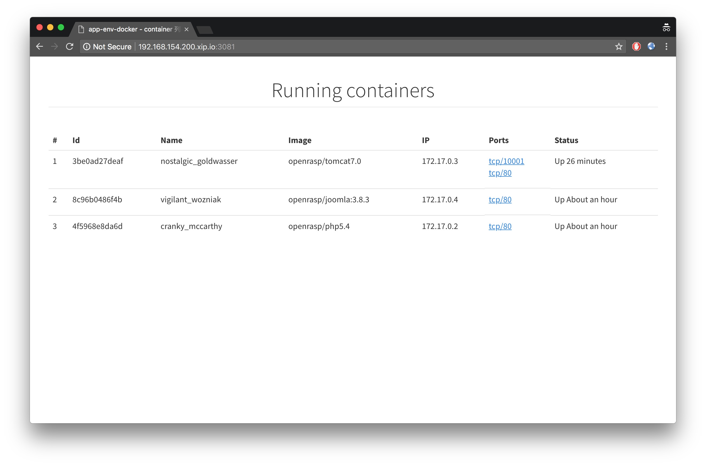

# app-env-docker

基于 Docker 的真实应用测试环境。我们构建这个仓库是为了快速测试大量漏洞，并补充到 [CVE 漏洞覆盖说明](https://rasp.baidu.com/doc/usage/cve.html) 里。和网上已有的 [vulhub](https://github.com/vulhub/vulhub)、[vulapps](https://github.com/Medicean/VulApps) 相比，我们具有如下优势:

1. 下载的资源存储在 [https://packages.baidu.com/app/](https://packages.baidu.com/app/)，更加可靠
2. 完全基于 `Dockerfile`，可定制化更强；执行 `make` 就可以启动环境，无需修改参数，非常方便
3. 专注 Web 漏洞，覆盖漏洞更多；可用于扫描器开发或者 OpenRASP 漏洞测试
4. 使用改造过的 [socks5](socks5/) 代理自动转发请求，更加灵活

其他说明文档

* [漏洞列表 - exploits](exploits)
* [环境列表 - src](src)
* [编码规范 - wiki](/wiki/)

## 使用方法

构建，并启动指定应用，e.g

```
make -C src/zzcms/8.2
```

启动后，会直接进入一个 bash shell，可以使用 curl 测试应用是否正常，e.g

```
[ubuntu-server: /share/docker]
# make -C src/seacms/6.45/
make: Entering directory '/share/docker/src/seacms/6.45'
docker build -t openrasp/seacms:6.45 .
Sending build context to Docker daemon 23.04 kB
Step 1/14 : FROM openrasp/php5.4
 ---> 0c8fc9d4a64a

-- 精简掉的内容 --

Step 14/14 : RUN chown mysql -R /var/lib/mysql
 ---> Running in 586aa2f25f15
 ---> 2bc8468709c0
Removing intermediate container 586aa2f25f15
Successfully built 2bc8468709c0
docker run --rm -it openrasp/seacms:6.45
[-] Starting Apache
AH00558: httpd: Could not reliably determine the server's fully qualified domain name, using 172.17.0.2. Set the 'ServerName' directive globally to suppress this message
[-] Starting MariaDB
[-] Waiting for MySQL to start ...
[-] Accessing 127.0.0.1 for the first time
[-] Dropping shell
 -  HostName:    f615004ffa66
 -  IP address:  172.17.0.2

[OpenRASP] root@f615004ffa66:/var/www/html #
```

## 自动化代理方案

### 方案1 - nginx proxy_pass 方式

需要设置转发IP，适合每次只运行一个镜像的场景

```
server {
    listen 81;
    location / {
        proxy_set_header Host $http_host;
        proxy_pass http://172.17.0.2;
    }
}
```

### 方案2 - PAC + xip.io 自动化代理方案

具体请参考 [socks5/readme.md](socks5/readme.md)

界面截屏如下




