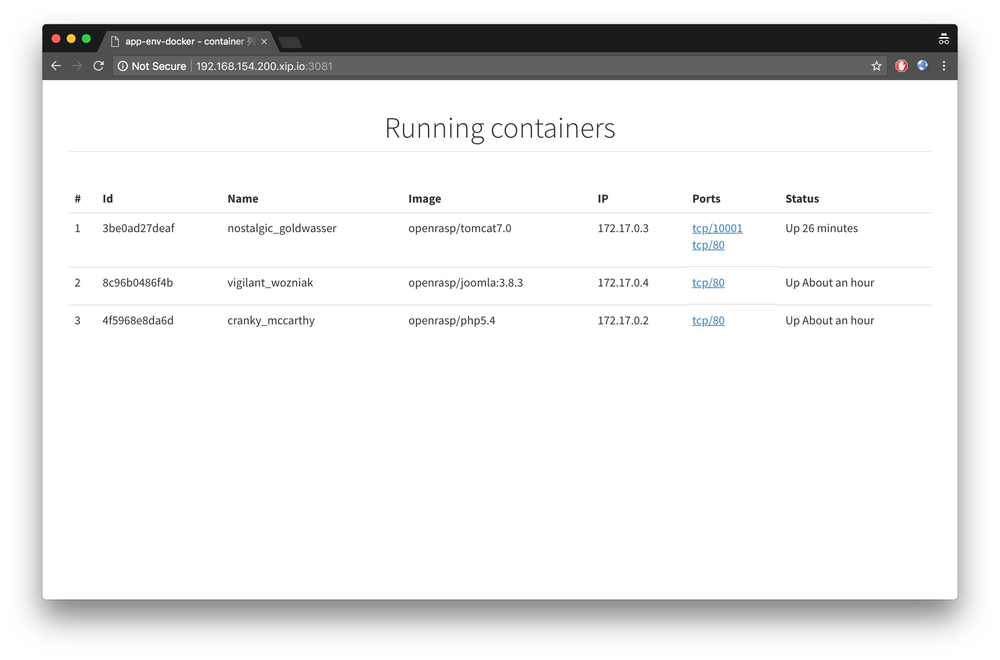
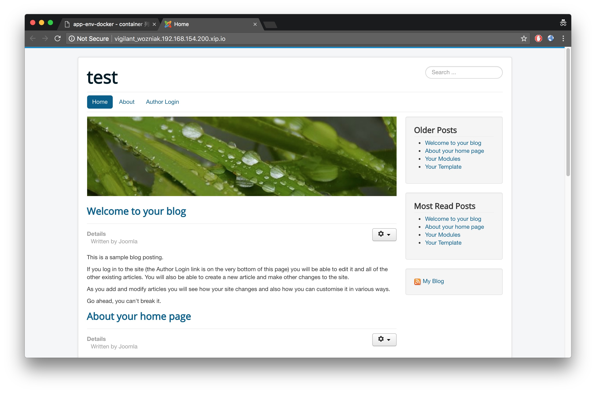

# Docker 测试环境 - 自动化代理方案

本工程包含一个改造过的 socks5 代理 (3080 端口），以及一个 HTTP 服务器（3081 端口）

## 使用方法

假设虚拟机的 IP 为 `192.168.154.200`，你需要按照如下步骤使用本代理服务

1. 在虚拟机里安装 docker，并设置监听端口为 `127.0.0.1:2375`
2. 启动一些你需要的镜像
3. 启动本服务，e.g `./bin/socks5`
4. 在浏览器里配置 PAC，e.g

   ```
   function FindProxyForURL(url, host) {
      ...

      if (host.indexOf('.192.168.154.200.xip.io') != -1) {
         return 'SOCKS5 192.168.154.200:3080';
      }
    
      ...
   }
   ```

4. 使用 `192.168.154.200.xip.io:3081` 访问虚拟机的主页

另外，对于非HTTP协议的，可以使用 `proxychains-ng` 访问，配置样例

```
strict_chain
proxy_dns
remote_dns_subnet 224
tcp_read_time_out 15000
tcp_connect_time_out 8000
[ProxyList]
socks5 192.168.154.200 3080
```

## 截图

主界面



应用界面 - 点击主页面的端口号进入




